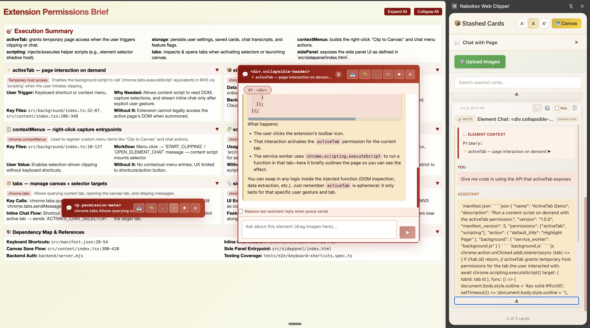
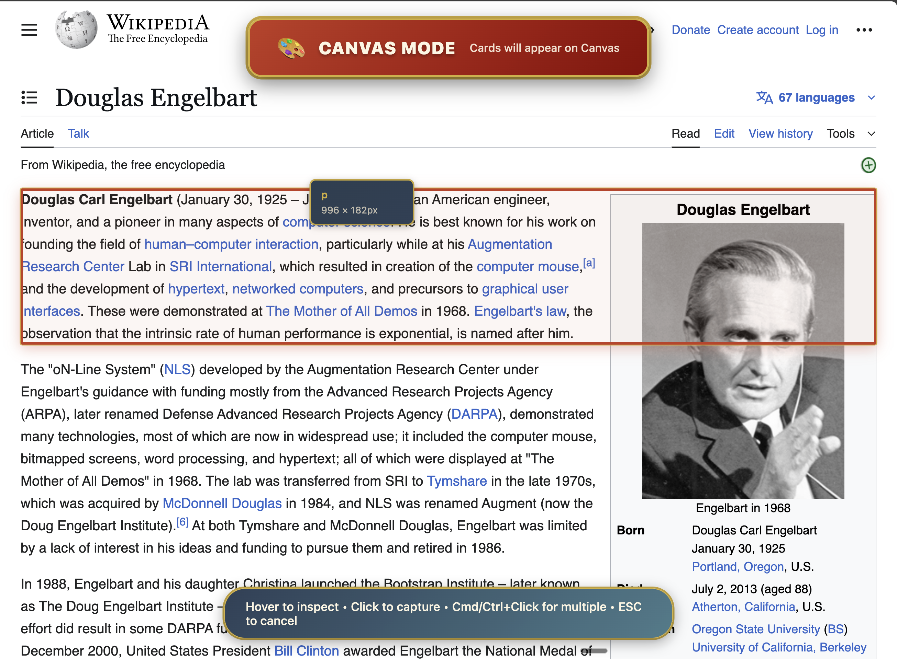

# SchemaConstruct

A Chrome extension that lets you save, browse, and chat with any HTML element on the web. Transform any webpage into an interactive workspace where you can clip elements to a visual canvas, organize your research, and have AI conversations about specific content.

**Developed as part of CS2790R: Research Topics in Human-Computer Interaction at Harvard University.**

## Features

- **Chat with Elements**: Right-click any element on a webpage to start an AI conversation about it
- **Element Clipping**: Save webpage elements to a visual canvas workspace for later reference
- **Stash Mode**: Quick-save elements to your side panel for easy access
- **Text Selection Chat**: Select text and press **Ctrl+Shift+C** to chat about specific content
- **Side Panel Integration**: Access all your saved conversations and clipped elements in Chrome's side panel
- **Visual Canvas**: Drag-and-drop organization of saved elements in a spatial workspace

## Quick Start

### Installation

1. Clone this repository
2. Install dependencies: `npm install`
3. Build the extension: `npm run build:extension`
4. Open `chrome://extensions` and enable **Developer mode**
5. Click **Load unpacked** and select the `dist/` folder

### Usage

- **Ctrl+Shift+E**: Activate element selector (Canvas mode)
- **Cmd+Shift+E** (Mac) / **Alt+Shift+E**: Activate element selector (Stash mode)
- **Ctrl+Shift+C**: Toggle chat selector (works with text or elements)
- **ESC**: Close active selector or chat

## Development

### Commands

```bash
npm run dev                    # Start Vite dev server
npm run watch:extension        # Watch mode for extension development
npm run build:extension        # Build extension for loading unpacked
npm test                       # Run unit tests
npm run test:e2e               # Run E2E tests
npm run type-check             # TypeScript type checking
```

### Architecture

- **Background Script** (`src/background/`): Service worker handling keyboard commands and message routing
- **Content Script** (`src/content/`): Injected into web pages, manages Shadow DOM components
- **Canvas** (`src/canvas/`): Standalone page for organizing clipped elements with React Flow
- **Side Panel** (`src/sidepanel/`): Chrome side panel for accessing stashed elements

See `CLAUDE.md` for detailed architecture documentation.

---

## Demos

| Using on Normal Website | AI-Generated HTML Explainer | Side Panel Integration |
|:---:|:---:|:---:|
|  |  |  |
| *SchemaConstruct on a normal website: Chat with any HTML element by right-clicking and selecting "Chat with Element"* | *Working on AI-generated content: The extension seamlessly integrates with AI-generated HTML pages, enabling recursive AI interactions* | *Side panel integration: Access all your saved conversations and clipped elements in Chrome's side panel for easy reference* |

| Clipping Elements to Canvas | Canvas View |
|:---:|:---:|
|  |  |
| *Clipping to canvas: Select and save any webpage element to your personal canvas for later reference and organization* | *Canvas workspace: A visual workspace where all your clipped elements are organized, allowing drag-and-drop arrangement and spatial organization of ideas* |
